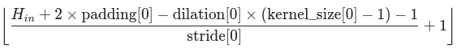
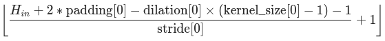

# Filters vizualization in CNN

## Datasets

### Intel Image Classification

https://www.kaggle.com/puneet6060/intel-image-classification

Dataset contain 25k images of size 150px x 150px. Dataset has 6 classes:

```
{
'buildings' -> 0,
'forest' -> 1,
'glacier' -> 2,
'mountain' -> 3,
'sea' -> 4,
'street' -> 5
}
```

### Cifar-10

https://www.cs.toronto.edu/~kriz/cifar.html

https://www.kaggle.com/swaroopkml/cifar10-pngs-in-folders

Dataset contain 60k images of size 32px x 32px. Dataset has 10 classes:

```
{
'airplane' -> 0,
'automobile' -> 1,
'bird' -> 2,
'cat' -> 3,
'deer' -> 4,
'dog' -> 5,
'frog' -> 6,
'horse' -> 7,
'ship' -> 8,
'truck' -> 9
}
```

## CNN

Convolutional neural network has fallowing structure for Intel Dataset: `Conv2d [5, 5] -> ReLu -> Conv2d [5, 5] -> ReLu Conv2d [5, 5] -> ReLu -> maxPool2d [2, 2] -> Conv2d [5, 5] -> ReLu -> Conv2d [5, 5] -> ReLu -> maxPool2d [2, 2] -> fc1 -> fc2 -> fc3`

and for Cifar-10 Dataset:
`Conv2d [3, 3] -> ReLu -> maxPool2d [2, 2] -> Conv2d [3, 3] -> ReLu -> fc1 -> fc2 -> fc3`

Purpose of this work is to find the most efficient way to train a neural network to get the best correctness of classification.
Several experiments will be conducted to find the best parameters such as filters size and filters quanitity.
There will be also examinated influence of kernels initialization to correctness of classification.

There also will be implemented filters and features map vizualization.

How to calculate Conv2d out size and MaxPool2d out size:

Conv2d:



MaxPool2d:



## ToDo

- [x] crossvalidation
- [x] fix visualization
- [x] experiment to choose best filters quantity
- [x] implementation of custom inicialization of weights
- [x] experiment to choose best inicialization of weights
- [x] code refactor and comments
