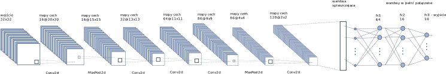

## Datasets

### Intel Image Classification

https://www.kaggle.com/puneet6060/intel-image-classification

Dataset contain 25k images of size 150px x 150px. Dataset has 6 classes:

```
{
'buildings' -> 0,
'forest' -> 1,
'glacier' -> 2,
'mountain' -> 3,
'sea' -> 4,
'street' -> 5
}
```

### Cifar-10

https://www.cs.toronto.edu/~kriz/cifar.html

https://www.kaggle.com/swaroopkml/cifar10-pngs-in-folders

Dataset contain 60k images of size 32px x 32px. Dataset has 10 classes:

```
{
'airplane' -> 0,
'automobile' -> 1,
'bird' -> 2,
'cat' -> 3,
'deer' -> 4,
'dog' -> 5,
'frog' -> 6,
'horse' -> 7,
'ship' -> 8,
'truck' -> 9
}
```

## CNN models

Convolutional neural network has fallowing structure for Intel Dataset:


and for Cifar-10 Dataset:



Purpose of this project is to find the most efficient way to train a neural network to get the best accuracy.
Several experiments will be conducted to find the best parameters such as filters size and filters quantity.
There will be also examined influence of kernels initialization (Xavier Initialization and modified Xavier Initialization) to accuracy.

How to calculate Conv2d Layer out size and MaxPool2d Layer out size:

Conv2d:


MaxPool2d:


# Filters, features map and gradient visualization in CNN

Input image:


Features map:


Gradients:


## SHapley analysis

"SHAP (SHapley Additive exPlanations) is a game theoretic approach to explain the output of any machine learning model. It connects optimal credit allocation with local explanations using the classic Shapley values from game theory and their related extensions"

https://github.com/slundberg/shap
